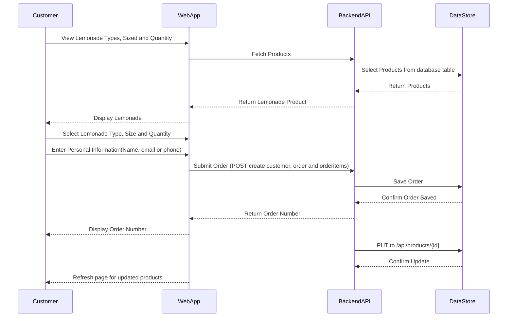

# Manulife Lemonade Stand

## Table of Contents
- [Setup](#setup)
- [Bonus Sequence Diagram](#bonus-sequence-diagram)
- [Improvements](#improvements)
- [Assumptions Made](#assumptions-made)

## Setup

Everything has a Dockerfile and this project uses `docker-compose`, so as long as you have Docker installed, the setup should be simple.

1. Run docker compose

```
docker-compose up --build
```

2. Update database

```
dotnet ef database update
```

3. After docker-compose

You can then visit `http://localhost:3000/` for the frontend
and `http://localhost:5001/swagger/index.html` for the backend swagger docs.

## Bonus Sequence Diagram

### Order Management Sequence Diagram



## Improvements

1. There were no mockups for the checkout page, so I would spend more time making it look closer to the root page.
2. I used Carter to help create the endpoints instead of putting them in the `Project.cs` file directly, but it's not common practice to have the DB context referenced in your endpoints. With more time, I would implement the repository pattern and use service classes for Product, Customer, Order, and OrderItem.
3. In order to create the customer and order, I am calling multiple RESTful endpoints: `api/customer`, `api/order`, `api/orderitem`. If one of these fails, there is no transaction to roll back the data. I would either create an endpoint that handles this in the backend or update the frontend to clean up after one or more fail.
4. Creating Request and Response objects for all resources.
5. Use FluentValidation on Services.

## Assumptions Made

1. I assumed a checkout page was wanted in order to add name, phone number, and email. I went ahead and created a basic checkout page but didn't have any designs to go off of. If this was a real ticket, I would work with my PM and designers on the team to come up with a good solution for the best UX.
2. I didn't make all CRUD endpoints for all the resources. However, I did make a PUT update for the Product resource because one of the criteria said, "Allow you to modify lemonade types and sizes in the datastore and automatically update types and sizes displayed to the customer." I wasn't sure if this meant to go into the database itself and update or via an endpoint.
3. Setting up HTTPS with .NET in Docker can be challenging and may vary depending on the operating system you're using. Therefore, for simplicity, I stick with HTTP.

