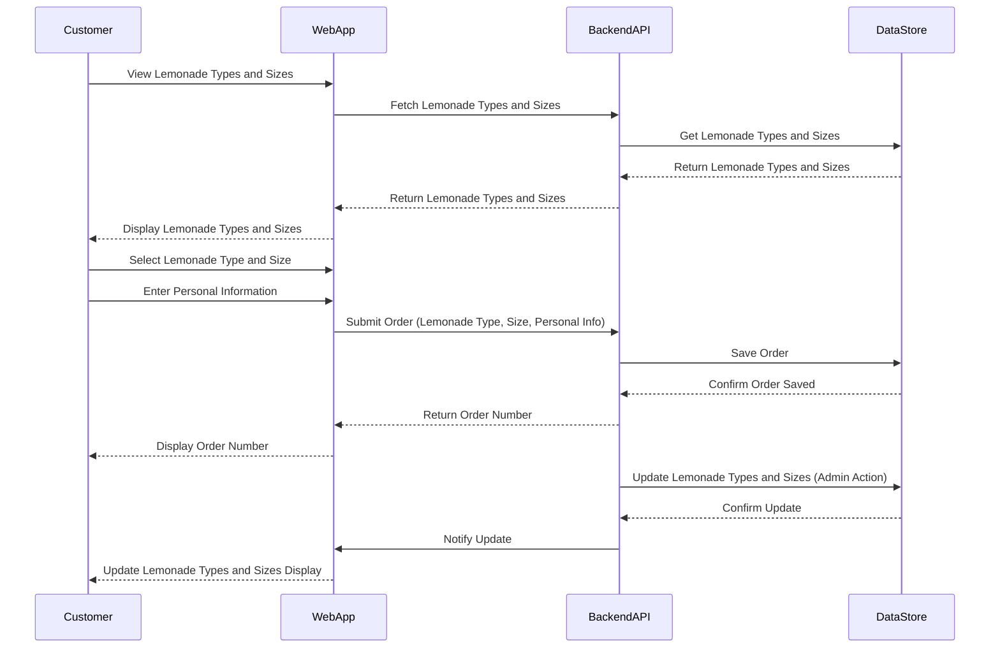

# manulife-lemonade-stand

## Order Management Sequence Diagram

```mermaid
sequenceDiagram
    participant Customer
    participant WebApp
    participant BackendAPI
    participant DataStore

    Customer ->> WebApp: View Lemonade Types and Sizes
    WebApp ->> BackendAPI: Fetch Lemonade Types and Sizes
    BackendAPI ->> DataStore: Get Lemonade Types and Sizes
    DataStore -->> BackendAPI: Return Lemonade Types and Sizes
    BackendAPI -->> WebApp: Return Lemonade Types and Sizes
    WebApp -->> Customer: Display Lemonade Types and Sizes

    Customer ->> WebApp: Select Lemonade Type and Size
    Customer ->> WebApp: Enter Personal Information
    WebApp ->> BackendAPI: Submit Order (Lemonade Type, Size, Personal Info)
    BackendAPI ->> DataStore: Save Order
    DataStore -->> BackendAPI: Confirm Order Saved
    BackendAPI -->> WebApp: Return Order Number
    WebApp -->> Customer: Display Order Number

    BackendAPI ->> DataStore: Update Lemonade Types and Sizes (Admin Action)
    DataStore -->> BackendAPI: Confirm Update
    BackendAPI ->> WebApp: Notify Update
    WebApp -->> Customer: Update Lemonade Types and Sizes Display
```
